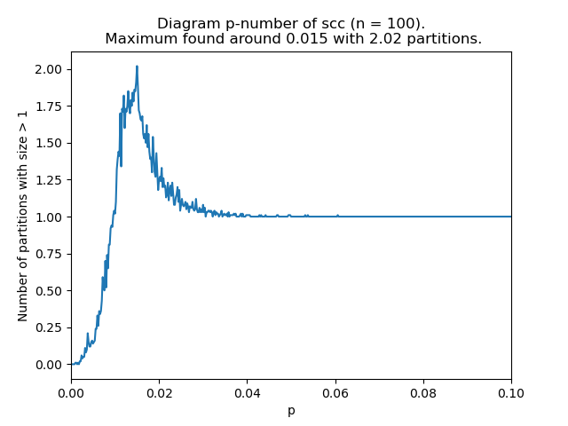
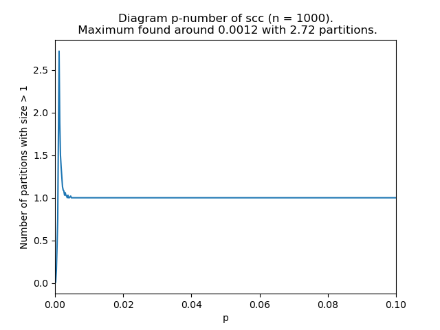
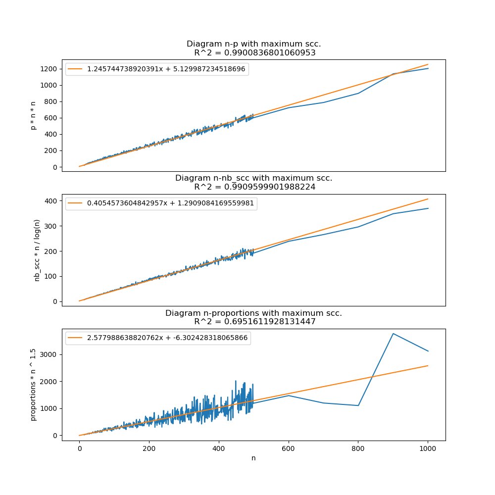
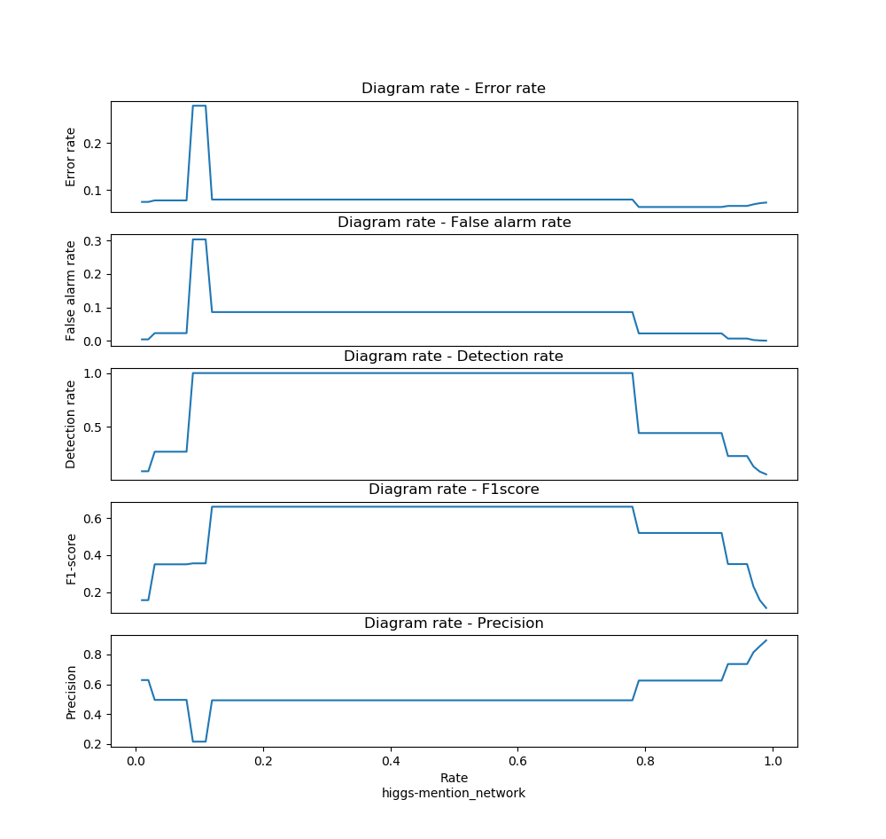

* The original projects is on [this site](https://gitlab.com/pinnertw/connected-components). You can find out the commit history there.

# Connected-Components

Projet "Finding Connected Components" pour INF442

## Required :
In order to plot the network, you might have matplotlib and networkx installed on your computer. Both of them are available with pip.

You can find out the [manuel of networkx](https://networkx.github.io/documentation/stable/index.html).

## Installation :
```
make install
```

## Usage :
If you are under linux system, those bash scripts are very useful. If not, there are precise instruction in those .sh files.

### Test Tarjan algorithm on ER-digraph:
```
./ER.sh n p
```
where n is the number total of nodes, and p the probability to have an edge between these nodes.

### Show the number of scc in function of p:
```
./ER-p.sh n
```
Here are some example output:




In order to analyse the result, use:
```
./python(3) src/analysis_n-p.py
```


### Test Tarjan algorithm and DBSCAN algorithm on a specified data:
```
./TDB.sh data/dataname (lambda) (M)
```
or
```
./TDB.sh data/dataname (rate)
```
### Testing different rate (from 0.01 to 0.99) on a certain data:
```
./DBSCAN_rate.sh data/data
```
Example output:



### Test with DBSCAN on 2D graph:
```
./2D.sh n p
```
where n is the number total of nodes and p the probability to have an edge between these nodes.

## Data format :
You can try with any dataset with the following format:

### Variables :
Weighted (w): 0 or 1      (0 if not weighted, 1 if weighted)

Directed (d): 0 or 1      (0 if not directed, 1 if directed)

Number of nodes (n)

Number of edges (m)

m lines for edges :

(from) (to) (weight)     weight is not necessary if w = 0


### The data format should be:

w d

n m

from_1 to_1 (weight_1)

.
.
.


from_m to_m (weight_m)

You can also find out dataset available with this format on :
[Dataset](https://drive.google.com/open?id=1nRTf6preEdH0OU9Q0X_DZfXaZkXgld8k)
